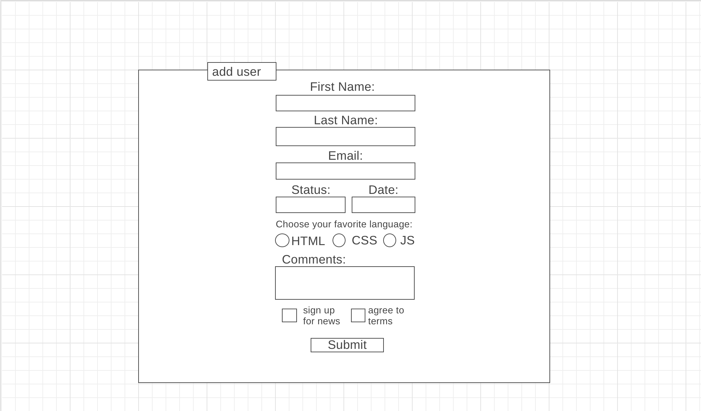
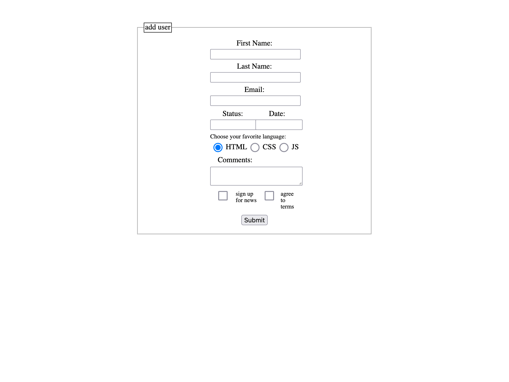

# CSS Layout Practice

## Task: Turn Wireframe in to html/css

### Wireframe

### Final Result

I've also included a flexbox and grid simplified version where I constructed some elements with css, then styled them with first flexbox, then grid.
